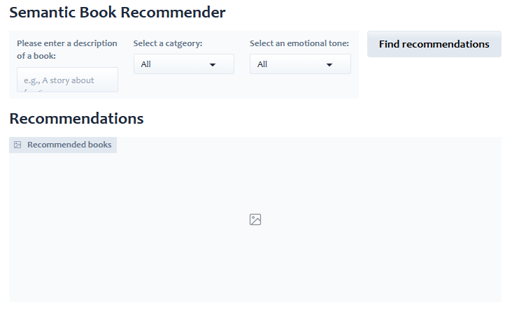
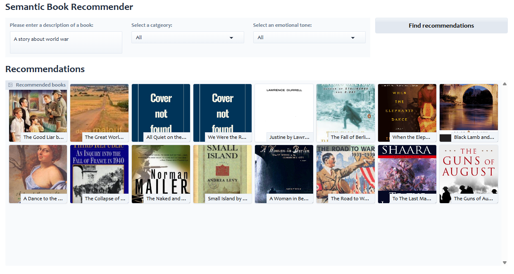
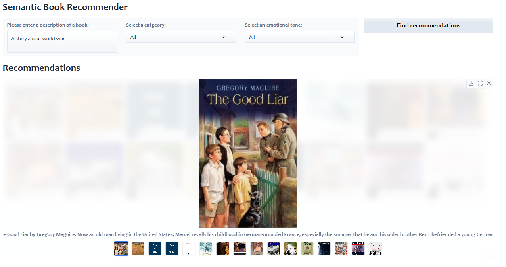

# Build a Semantic Book Recommender with LLMs

The data for this project can be downloaded from Kaggle. [Dataset Link](https://www.kaggle.com/datasets/dylanjcastillo/7k-books-with-metadata)

In order to create your vector database, you'll need to create a .env file in your root directory containing your `OPENAI_API_KEY`.

This repo contains the code to build a semantic book recommender. There are five components to this repo:

* Text data cleaning (code in the notebook `data_exploration.ipynb`)
* Semantic (vector) search and how to build a vector database (code in the notebook `vector_search.ipynb`). This allows users to find the most similar books to a natural language query (e.g., "a book about a person seeking revenge").
* Doing text classification using zero-shot classification in LLMs (code in the notebook `text_classification.ipynb`). This allows us to classify the books as "fiction" or "non-fiction", creating a facet that users can filter the books on.
* Doing sentiment analysis using LLMs and extracting the emotions from text (code in the notebook `sentiment_analysis.ipynb`). This will allow users to sort books by their tone, such as how suspenseful, joyful or sad the books are.
* Creating a web application using Gradio for users to get book recommendations (code in the file `gradio_dashboard.py`).

<br>

Run the project with following commands:
```bash
uv sync
uv run gradio_dashboard.py
```

<br>
Some screenshots of the dashboard:





